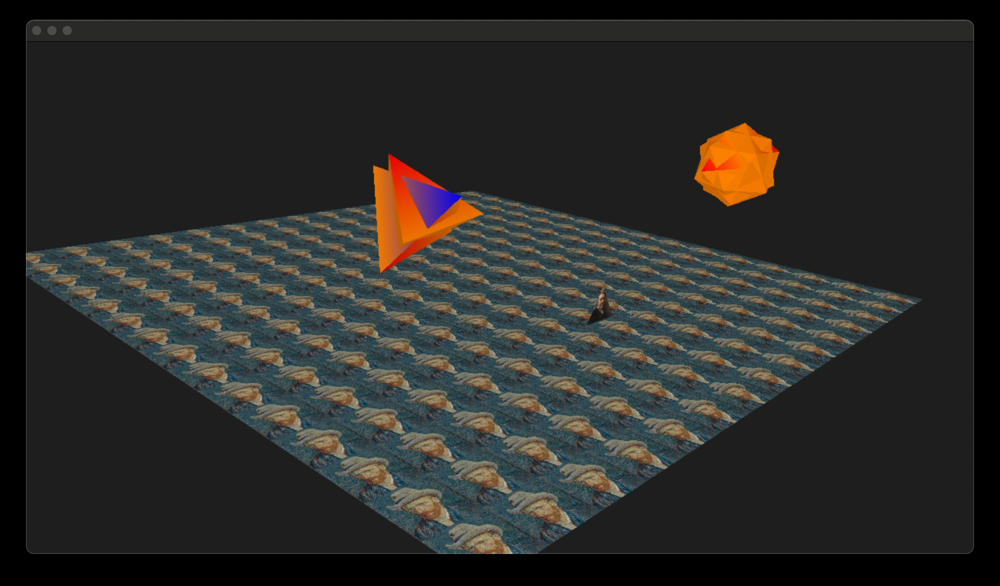
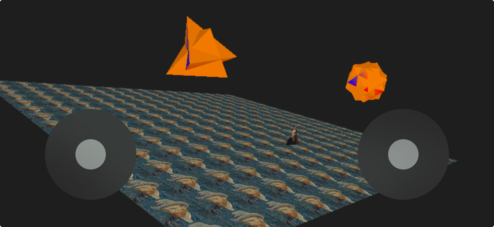

# Swift3DRenderer

Swift and C++ implementation of a simple 3d render engine. All the calculations are deliberately done on CPU instead of GPU to see what hardware accelerators like Metal do under the hood. Therefor it doesn't use Metal _directly_, but it does use Metal drawables to render the generated pixel buffer into its layers' texture.

An example of the scene on MacOS:

An example of the scene on iOS:

####Implemented features are:

* runs on iOS target (with 2 controller, see picture above)
* runs on MacOS target (with mouse/trackpad and WASD on keyboard)
* also builds from command line: `Makefile` provided with targets `main` and `main-cpp`
* window is live resizable (on MacOS)
* render code is provided for swift as as well as for C++; C++ is compiled into a `.dylib` that is dynamically loaded into the (swift) main loop
* added Xcode schemes to compile with `-O` (swift) or `-O2` (C++) instead
* supports colors and textures
* supports tetrahedrons and isocahedrons objects
* [anisotropic filtering](https://github.com/sarastro-nl/swift-anisotropic) for smooth texture coloring of textures that are in the distance under a shallow angle
* supports a d-buffer: only objects that are nearer will be rendered
* frustum clipping on the near plane by adjusting the triangle or adding a new smaller fitting triangle

Although I've tried to push the limits of the CPU by making the code as efficient as I possibly can, it's aim is not speed . It is meant to be purely educational to understand the basic features needed to render a simple 3d world where you can fly around.

The main loop calls `updateAndRender()` (in case of C++: the version in `render.dylib`) at 60fps which on its turn fills a pixel buffer with RGB info that is written to the layers' texture of a Metal drawable.

There is a scene data generator in `data-generator/main.swift`. When changed it will generate a new `data.bin` containing the vertex and attribute data including the texture images that will be read at startup by the renderer.

I am aware of instructions sets like MMX and friends to make simd functions work faster. The reason that I've used these functions instead is that they are easier to read and to be less hardware dependent.
